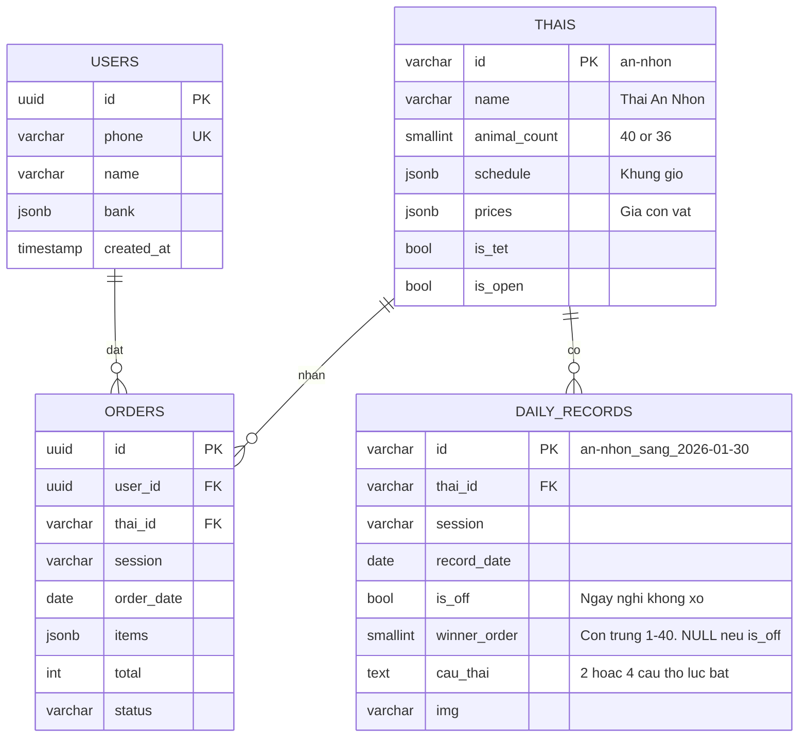

# 🗄️ DATABASE SCHEMA TỐI ƯU V2

> **Nguyên tắc**: Chỉ **4 bảng**, không lưu data tĩnh, gộp bảng cùng key structure

## 📊 Tổng quan (4 bảng)

| Bảng | Records | Mô tả | Growth |
|------|---------|-------|--------|
| `thais` | 3 | Khu vực + config | Cố định |
| `users` | ~15K/tháng | Người dùng | Tăng |
| `orders` | ~30K/tháng | Đơn hàng | Tăng nhanh |
| `daily_records` | ~6/ngày | Kết quả + Câu Thai + Nghỉ | Tăng chậm |

---

## 🛠️ ORM & Redis Recommendations

### ORM: Prisma (Recommended)

| Lý do dùng | Chi tiết |
|------------|----------|
| **Type-safe queries** | Auto-gen types từ schema, tránh lỗi runtime |
| **Migrations** | Quản lý schema changes dễ dàng |
| **Relations** | Xử lý FK tự động, không cần viết JOIN |
| **Logging** | Query logging built-in cho debug |

```typescript
// Ví dụ Prisma query
const todayResults = await prisma.daily_records.findMany({
  where: { record_date: new Date(), is_off: false },
  include: { thai: true }
});
```

> ⚠️ **Không cần ORM nếu**: Chỉ có 4 bảng đơn giản, team quen raw SQL

### Redis: Cần cho 3 use cases

| Use Case | Tại sao cần | TTL |
|----------|-------------|-----|
| **1. Countdown cache** | Sync real-time countdown giữa clients | 60s |
| **2. Today's results** | Cache kết quả hôm nay, giảm DB hits | 5 phút |
| **3. Rate limiting** | Chống spam đặt đơn | 1 phút |

```typescript
// Redis keys
`countdown:an-nhon:sang`     // TTL 60s - thời gian còn lại
`results:2026-01-30`         // TTL 5min - kết quả hôm nay  
`ratelimit:user:uuid:order`  // TTL 60s - 1 order/phút
```

> 💡 **VPS nhỏ**: Redis chạy cùng server, dùng ~50MB RAM

---

## ⚡ Tại sao chỉ 4 bảng?

| Bảng cũ | Lý do bỏ/gộp |
|---------|--------------|
| ~~`animals`~~ | Danh sách 40/36 con vật **cố định** → lưu constant trong code (ANIMAL_DATA.ts) |
| ~~`cau_thais`~~ | Gộp vào `daily_records` (cùng key: thai_id + session + date) |
| ~~`ket_quas`~~ | Gộp vào `daily_records` - MỖI LƯỢT XỔ CHỈ 1 CON TRÚNG |

---

## 📦 ANIMAL_NAMES (Constant - không lưu DB)

```typescript
// constants/animals.ts - KHÔNG CẦN BẢNG DATABASE
export const ANIMAL_NAMES = [
  'Cá Trắng', 'Ốc', 'Ngỗng', 'Công', 'Trùn', 'Cọp', 'Heo', 'Thỏ', 'Trâu', 'Rồng Bay',
  'Chó', 'Ngựa', 'Voi', 'Mèo', 'Chuột', 'Ong', 'Hạc', 'Kỳ Lân', 'Bướm', 'Hòn Núi',
  'Én', 'Bồ Câu', 'Khỉ', 'Ếch', 'Quạ', 'Rồng Nằm', 'Rùa', 'Gà', 'Lươn', 'Cá Đỏ',
  'Tôm', 'Rắn', 'Nhện', 'Nai', 'Dê', 'Bà Vãi', 'Ông Trời', 'Ông Địa', 'Thần Tài', 'Ông Táo'
] as const; // 40 con, Hoài Nhơn chỉ dùng 1-36

export const getAnimalName = (order: number) => ANIMAL_NAMES[order - 1];
```

---

## 🔗 ERD Diagram



---

## 📝 SQL Schema (PostgreSQL)

```sql
-- =============================================
-- BANG 1: THAIS (3 records co dinh)
-- =============================================
CREATE TABLE thais (
    id VARCHAR(20) PRIMARY KEY,           -- 'an-nhon', 'nhon-phong', 'hoai-nhon'
    name VARCHAR(50) NOT NULL,
    animal_count SMALLINT NOT NULL,       -- 40 hoac 36
    schedule JSONB NOT NULL,              -- Khung gio cac phien
    prices JSONB DEFAULT '{}',            -- Override gia: {"1": 15000, "5": 20000}
    limits JSONB DEFAULT '{}',            -- Override limit: {"1": 3000000}
    is_tet BOOLEAN DEFAULT FALSE,
    is_open BOOLEAN DEFAULT TRUE
);

INSERT INTO thais VALUES
('an-nhon', 'Thai An Nhon', 40, 
  '{"sang":{"start":"07:00","close":"10:30","draw":"11:00"},"chieu":{"start":"13:00","close":"16:30","draw":"17:00"}}', 
  '{}', '{}', false, true),
('nhon-phong', 'Thai Nhon Phong', 40,
  '{"sang":{"start":"07:00","close":"10:30","draw":"11:00"},"chieu":{"start":"13:00","close":"16:30","draw":"17:00"}}',
  '{}', '{}', false, true),
('hoai-nhon', 'Thai Hoai Nhon', 36,
  '{"trua":{"start":"09:00","close":"12:30","draw":"13:00"},"chieu":{"start":"14:00","close":"18:30","draw":"19:00"}}',
  '{}', '{}', false, true);

-- =============================================
-- BANG 2: USERS
-- =============================================
CREATE TABLE users (
    id UUID PRIMARY KEY DEFAULT gen_random_uuid(),
    phone VARCHAR(15) NOT NULL UNIQUE,
    name VARCHAR(50),
    bank JSONB,                           -- {"code":"VCB","acc":"123456","holder":"Nguyen Van A"}
    created_at TIMESTAMP DEFAULT NOW()
);

CREATE INDEX idx_users_phone ON users(phone);

-- =============================================
-- BANG 3: ORDERS (bang lon nhat)
-- =============================================
CREATE TABLE orders (
    id UUID PRIMARY KEY DEFAULT gen_random_uuid(),
    user_id UUID NOT NULL REFERENCES users(id),
    thai_id VARCHAR(20) NOT NULL REFERENCES thais(id),
    session VARCHAR(10) NOT NULL,         -- 'sang', 'chieu', 'toi', 'trua'
    order_date DATE NOT NULL DEFAULT CURRENT_DATE,
    items JSONB NOT NULL,                 -- [{"o":1,"q":2,"p":10000}]
    total INTEGER NOT NULL,
    status VARCHAR(10) DEFAULT 'pending', -- pending|paid|done|cancel
    created_at TIMESTAMP DEFAULT NOW()
);

CREATE INDEX idx_orders_lookup ON orders(thai_id, order_date, session);
CREATE INDEX idx_orders_user ON orders(user_id);
CREATE INDEX idx_orders_pending ON orders(status) WHERE status = 'pending';

-- =============================================
-- BANG 4: DAILY_RECORDS (gop ket_qua + cau_thai)
-- MOI LUOT XO CHI CO 1 CON TRUNG
-- =============================================
CREATE TABLE daily_records (
    id VARCHAR(50) PRIMARY KEY,           -- 'an-nhon_sang_2026-01-30'
    thai_id VARCHAR(20) NOT NULL REFERENCES thais(id),
    session VARCHAR(10) NOT NULL,
    record_date DATE NOT NULL,
    is_off BOOLEAN DEFAULT FALSE,         -- TRUE = ngay nghi khong xo
    winner_order SMALLINT,                -- 1-40 (NULL neu is_off=true). CHI 1 CON!
    cau_thai TEXT,                        -- 2 hoac 4 cau tho luc bat
    img VARCHAR(255),
    created_at TIMESTAMP DEFAULT NOW(),
    UNIQUE(thai_id, session, record_date)
);

CREATE INDEX idx_daily_date ON daily_records(record_date DESC);

-- VIEW tien query
CREATE VIEW v_today AS
SELECT d.thai_id, t.name, d.session, d.winner_order, d.cau_thai
FROM daily_records d JOIN thais t ON t.id = d.thai_id
WHERE d.record_date = CURRENT_DATE;
```

---

## ⚡ Query Examples

```sql
-- Ket qua hom nay
SELECT * FROM v_today;

-- Orders theo thai + ngay
SELECT * FROM orders WHERE thai_id = 'an-nhon' AND order_date = CURRENT_DATE;

-- Doanh thu
SELECT thai_id, SUM(total) FROM orders WHERE order_date = CURRENT_DATE GROUP BY 1;

-- Con trung nhieu nhat (nam)
SELECT (elem::int) as animal, COUNT(*) as wins
FROM daily_records, jsonb_array_elements(winners) as elem
WHERE EXTRACT(YEAR FROM record_date) = 2026
GROUP BY 1 ORDER BY 2 DESC LIMIT 10;
```

---

## 📦 Items JSON Format (Compact)

```json
[{"o": 1, "q": 2, "p": 10000}]
```

| Field | Y nghia | Tiet kiem |
|-------|---------|-----------|
| `o` | order (so thu tu con vat) | vs `animal_order` |
| `q` | quantity | vs `quantity` |
| `p` | price | vs `unit_price` |

---

## 📈 Storage Estimate

| Bang | Records/nam | Size |
|------|-------------|------|
| thais | 3 | ~1KB |
| users | 180K | ~50MB |
| orders | 360K | ~250MB |
| daily_records | 2K | ~500KB |
| **TONG** | | **~300MB/nam** |

> VPS 1GB RAM + 10GB SSD du **10 nam** data
> Giam **33%** so voi schema 6 bang

---

## 🔄 Backup (1 lenh)

```bash
pg_dump -Fc conhon > /backup/conhon_$(date +%d).dump && find /backup -mtime +7 -delete
```

---

*Cap nhat: 30/01/2026 23:15*
