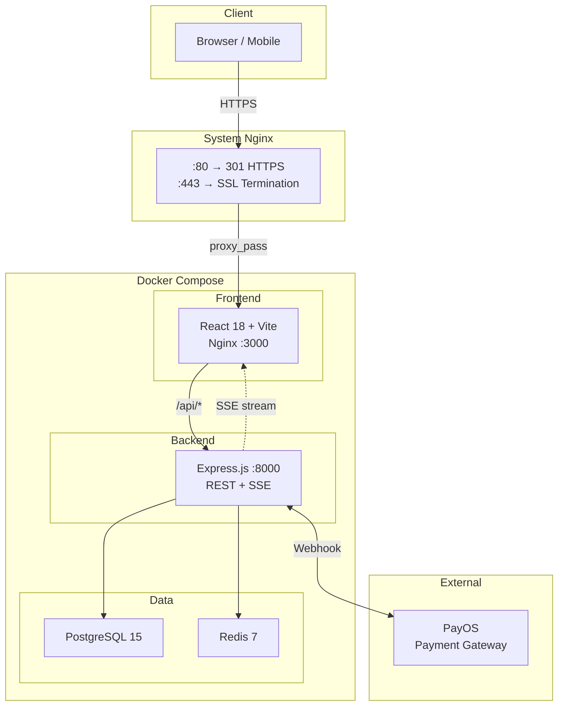
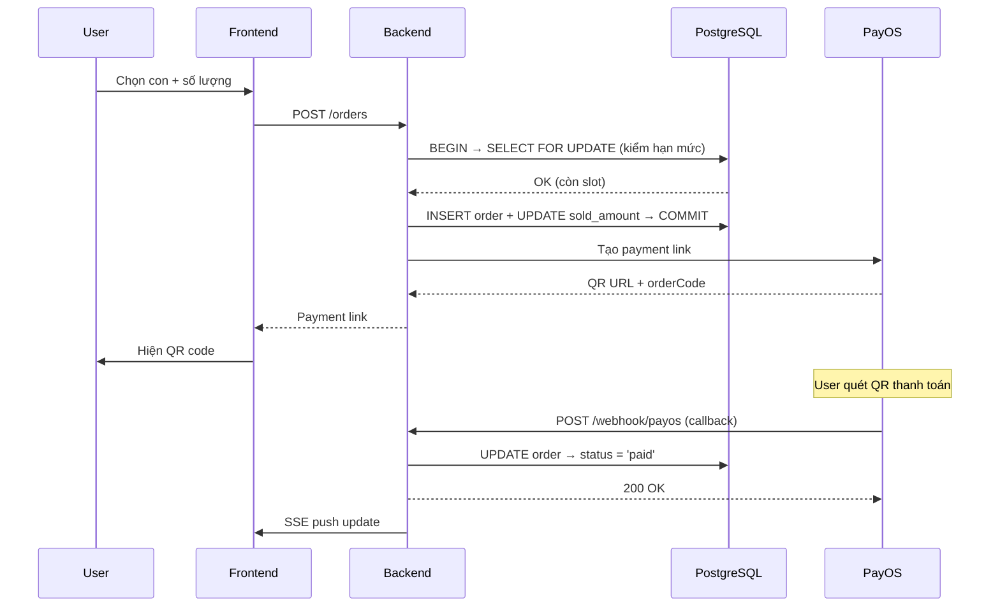

<p align="center">
  
</p>

<h1 align="center">Cổ Nhơn</h1>
<p align="center">
  <strong>Nền tảng đặt tịch trực tuyến — thanh toán QR, kết quả real-time, quản trị toàn diện.</strong>
</p>

<p align="center">
  
  
  
  
  
  
</p>

---

## TL;DR

Ứng dụng full-stack phục vụ **đặt tịch** (mua con vật) cho 3 thai vùng Bình Định — An Nhơn, Nhơn Phong, Hoài Nhơn.

- 🛒 **Đặt tịch** — Chọn con → thanh toán QR qua PayOS → xác nhận webhook tự động
- 📊 **Kết quả real-time** — SSE push kết quả xổ, hiển thị đúng giờ theo khung
- 🖼️ **Câu thai** — Admin upload ảnh theo thai + khung giờ, homepage tự hiển thị ảnh active
- 👨‍💼 **Admin CMS** — Dashboard, quản lý hạn mức, đơn hàng, cộng đồng, báo cáo doanh thu
- 🔒 **Session-centric** — Mọi dữ liệu xoay quanh phiên (thai × ngày × khung giờ)

**Tech**: React 18 · Express.js · PostgreSQL 15 · Redis 7 · PayOS · Docker Compose

🔗 **Production**: `https://conhonannhonbinhdinh.vn`

---

## Quickstart

### Docker (khuyên dùng)

```bash
git clone -b ready-production https://github.com/initforge/vhdg-conhon.git
cd vhdg-conhon

cp .env.production .env        # Sửa .env: DB_PASSWORD, JWT_SECRET, PAYOS keys
docker compose up --build -d   # 4 containers: frontend, backend, db, redis

# Init database
docker exec -i conhon-db psql -U conhon -d conhon < database/schema.sql
```

Mở **http://localhost:3000** → xong.

### Local dev

```bash
# Terminal 1 — Backend
cd backend && npm install
cp ../.env.production .env     # Sửa DATABASE_URL cho local
npm run dev                    # → http://localhost:8000

# Terminal 2 — Frontend
cd frontend && npm install
npm run dev                    # → http://localhost:5173
```

**Yêu cầu**: Node ≥ 18 · PostgreSQL 15 · Redis 7

---

## Features

| Tính năng | Chi tiết |
|-----------|----------|
| **Đặt tịch + QR Payment** | Chọn con → tạo order → PayOS QR → webhook xác nhận tự động |
| **Atomic hạn mức** | `SELECT ... FOR UPDATE` — race condition–proof, rollback khi huỷ |
| **Real-time SSE** | Push kết quả xổ, cập nhật hạn mức live, không cần polling |
| **Idempotent webhook** | PayOS callback xử lý đúng 1 lần, skip nếu đã processed |
| **Session-centric model** | Mỗi phiên = thai + ngày + khung giờ — isolation hoàn toàn |
| **Admin CMS** | Dashboard, quản lý 40 con/phiên, đơn hàng, cộng đồng, báo cáo |
| **Câu thai dynamic** | Upload ảnh theo thai + khung, toggle hiển thị, homepage filter tự động |
| **Dynamic config** | Master switch, bảo trì, bật/tắt thai — ThaiConfigContext toàn app |
| **Rate limiting** | Redis-backed, theo IP + endpoint |
| **Responsive** | Mobile-first, TailwindCSS, hoạt động mượt 360px–2K |

---

## Architecture



### Luồng đặt tịch (core flow)



---

## Tech Stack

| Layer | Công nghệ | Lý do chọn |
|-------|-----------|-----------|
| **Frontend** | React 18 + TypeScript + Vite | Type-safe, HMR nhanh, tree-shaking |
| **Styling** | TailwindCSS | Utility-first, responsive nhanh |
| **State** | React Context + useReducer | Đủ dùng, không cần Redux overhead |
| **Backend** | Express.js | Lightweight, middleware ecosystem |
| **Database** | PostgreSQL 15 | ACID, UUID PK, row-level locking |
| **Cache** | Redis 7 | Rate-limit counter, session cache |
| **Real-time** | SSE (Server-Sent Events) | Đơn giản hơn WebSocket cho 1-way push |
| **Payment** | PayOS | QR nội địa, webhook-based, phí thấp |
| **Upload** | Multer + static serve | Đơn giản, không cần S3 cho scale hiện tại |
| **Auth** | JWT (access + middleware) | Stateless, verify nhanh |
| **Infra** | Docker Compose | 1 lệnh deploy, reproducible |
| **SSL** | Let's Encrypt + Certbot | Free, auto-renew |

**Tại sao không dùng X?**
- **Không WebSocket** → SSE đủ cho 1-way push (kết quả, hạn mức). Ít phức tạp hơn.
- **Không S3** → Image upload ít, local volume + Nginx serve đủ nhanh.
- **Không Redux** → ThaiConfigContext + AuthContext xử lý đủ state cần share.

---

## Project Structure

```
conhon-production/
│
├── frontend/                       # React SPA
│   ├── src/
│   │   ├── pages/                  # Route-level pages
│   │   │   ├── HomePage.tsx        # Landing + câu thai + countdown
│   │   │   ├── admin/              # 7 admin tabs (Dashboard, ConVat, KetQua, ...)
│   │   │   └── user/               # 6 user tabs (MuaConVat, ThanhToan, ...)
│   │   ├── components/             # Shared UI (AnimalCard, Modal, ...)
│   │   ├── contexts/               # AuthContext, ThaiConfigContext
│   │   ├── services/api.ts         # Axios client, typed interfaces
│   │   └── constants/              # ANIMALS[], GAME_CONFIG, THAI_*
│   ├── nginx.conf                  # SPA routing + API proxy
│   └── Dockerfile                  # Multi-stage: npm build → nginx
│
├── backend/                        # Express.js API
│   ├── src/
│   │   ├── routes/
│   │   │   ├── admin.js            # Admin CRUD (sessions, orders, users, ...)
│   │   │   ├── order.js            # Đặt tịch + PayOS integration
│   │   │   ├── session.js          # Phiên: open/close, animal limits
│   │   │   ├── cau-thai.js         # Câu thai images API
│   │   │   └── webhook.js          # PayOS payment callback
│   │   ├── services/
│   │   │   ├── database.js         # pg Pool, query helper
│   │   │   ├── redis.js            # ioredis client
│   │   │   ├── payos.js            # PayOS SDK wrapper
│   │   │   └── sse.js              # SSE broadcast service
│   │   └── middleware/
│   │       ├── auth.js             # JWT verify + role check
│   │       └── rateLimiter.js      # Redis-backed rate limit
│   └── Dockerfile
│
├── database/
│   ├── schema.sql                  # 8 tables, indexes, constraints
│   └── exports/data.sql            # Production snapshot
│
├── docker-compose.yml              # 4 services orchestration
├── .env.production                 # Env template (secrets redacted)
├── SPECS.md                        # Đặc tả hệ thống (1400+ dòng)
└── VPS_SETUP.md                    # Triển khai + vận hành VPS
```

---

## API Examples

### Đăng nhập
```bash
curl -X POST http://localhost:3000/api/auth/login \
  -H "Content-Type: application/json" \
  -d '{"phone": "0901234567", "password": "123456"}'
```
```json
{
  "token": "eyJhbGciOiJIUzI1NiIs...",
  "user": { "id": "uuid", "name": "Nguyễn Văn A", "role": "user" }
}
```

### Đặt tịch (tạo order)
```bash
curl -X POST http://localhost:3000/api/orders \
  -H "Authorization: Bearer <token>" \
  -H "Content-Type: application/json" \
  -d '{
    "session_id": "uuid",
    "items": [
      { "animal_order": 1, "quantity": 2, "unit_price": 10000 },
      { "animal_order": 15, "quantity": 1, "unit_price": 10000 }
    ]
  }'
```
```json
{
  "order": { "id": "uuid", "total": 30000, "status": "pending" },
  "paymentUrl": "https://pay.payos.vn/web/xxx"
}
```

### Lấy kết quả xổ
```bash
curl "http://localhost:3000/api/sessions/results?thai_id=thai-an-nhon&date=2026-02-08"
```
```json
{
  "results": [
    {
      "session_type": "sang",
      "draw_time": "11:00",
      "winning_animal": 7,
      "animal_name": "Ngựa"
    }
  ]
}
```

---

## Quality & Engineering

| Hạng mục | Chi tiết |
|----------|----------|
| **Type safety** | TypeScript strict mode (frontend), typed API interfaces |
| **Auth** | JWT + middleware role-based (`user`, `admin`) |
| **Data integrity** | `SELECT ... FOR UPDATE` atomic locking, FK constraints, UNIQUE indexes |
| **Idempotency** | Webhook xử lý 1 lần — check `order.status !== 'pending'` |
| **Security** | Helmet headers, CORS whitelist, bcrypt password, rate-limit Redis |
| **Error handling** | Centralized error middleware, graceful DB rollback |
| **Real-time** | SSE with auto-reconnect, heartbeat keepalive |
| **Validation** | Input validation + sanitization trước mọi DB query |
| **Containerized** | Docker Compose — reproducible deploy, health checks |
| **SSL** | Let's Encrypt + auto-renew cron |

---

## Env Variables

```bash
# Database
DB_PASSWORD=               # PostgreSQL password

# Auth
JWT_SECRET=                # Random 64-char string

# Payment
PAYOS_CLIENT_ID=           # Từ https://my.payos.vn
PAYOS_API_KEY=             # PayOS API key
PAYOS_CHECKSUM_KEY=        # Webhook signature verify

# App
NODE_ENV=production
PORT=8000
FRONTEND_URL=https://conhonannhonbinhdinh.vn
VITE_API_URL=/api
```

---

## Roadmap

- [ ] Notification push (Zalo OA / SMS) khi có kết quả
- [ ] Audit log — ghi lại mọi thao tác admin
- [ ] Export báo cáo Excel/PDF
- [ ] Multi-tenant — mở rộng cho các vùng khác
- [ ] Rate limiting per user (không chỉ per IP)
- [ ] Monitoring + alerting (Prometheus + Grafana)

---

## License

Proprietary — © 2026 Cổ Nhơn, An Nhơn, Bình Định.
