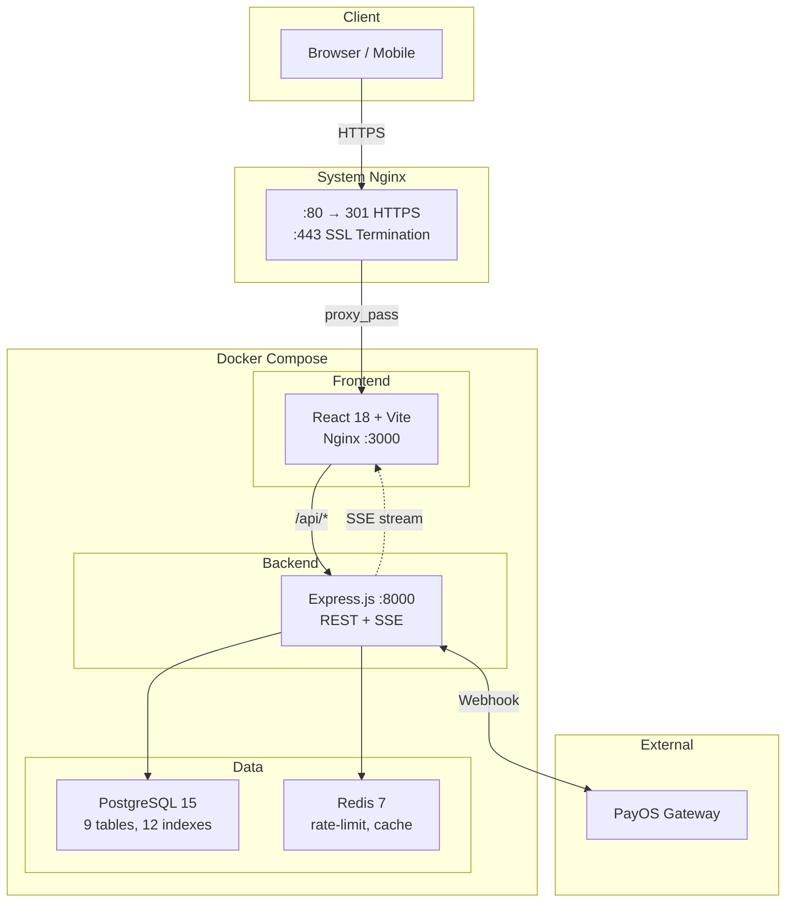
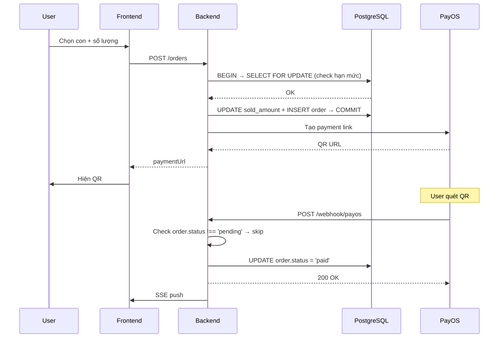

<p align="center">
  
</p>

<h1 align="center">Cổ Nhơn</h1>
<p align="center">
  <strong>Nền tảng đặt tịch trực tuyến — thanh toán QR, kết quả real-time, quản trị toàn diện.</strong>
</p>

<p align="center">
  
  
  
  
  
</p>

---

## Mục lục

- [TL;DR](#tldr)
- [Quickstart](#quickstart)
- [Features](#features)
- [Architecture](#architecture)
- [Tech Stack](#tech-stack)
- [Project Structure](#project-structure)
- [API Examples](#api-examples)
- [Makefile Commands](#makefile-commands)
- [Quality & Engineering](#quality--engineering)
- [Decision Log](#decision-log)
- [Env Variables](#env-variables)
- [Deployment](#deployment)
- [Roadmap](#roadmap)

---

## TL;DR

Ứng dụng full-stack phục vụ **đặt tịch** (mua con vật) cho 3 thai vùng Bình Định — An Nhơn, Nhơn Phong, Hoài Nhơn.

- 🛒 **Đặt tịch** — Chọn con → thanh toán QR qua PayOS → webhook xác nhận tự động
- 📊 **Real-time** — SSE push kết quả xổ + cập nhật hạn mức live
- 🖼️ **Câu thai** — Admin upload ảnh theo thai + khung giờ, homepage tự filter hiển thị
- 👨‍💼 **Admin CMS** — Dashboard, hạn mức, đơn hàng, cộng đồng, báo cáo doanh thu
- 🔒 **Session-centric** — Mọi dữ liệu xoay quanh Session = `{thai_id, date, session_type}`

**Tech**: React 18 · TypeScript · Express.js · PostgreSQL 15 · Redis 7 · PayOS · Docker Compose

🔗 **Production**: `https://conhonannhonbinhdinh.vn`

---

## Quickstart

### Docker (khuyên dùng)

```bash
git clone https://github.com/initforge/vhdg-conhon.git
cd vhdg-conhon

cp .env.example .env                   # Sửa: DB_PASSWORD, JWT_SECRET, PAYOS keys
docker compose up --build -d           # 4 containers: frontend, backend, db, redis
make init-db                           # Khởi tạo database schema
```

Mở **http://localhost:3000** → xong.

### Local dev

```bash
# Terminal 1 — Backend
cd backend && npm install
npm run dev                            # → http://localhost:8000

# Terminal 2 — Frontend
cd frontend && npm install
npm run dev                            # → http://localhost:5173
```

**Yêu cầu**: Node ≥ 18 · PostgreSQL 15 · Redis 7

---

## Features

| Tính năng | Implement |
|-----------|-----------|
| **QR Payment** | PayOS webhook → idempotent handler (`routes/webhook.js`) |
| **Atomic hạn mức** | `SELECT ... FOR UPDATE` — race condition–proof (`routes/order.js`) |
| **Real-time SSE** | Push kết quả + hạn mức, auto-reconnect (`routes/sse.js`) |
| **Session-centric** | UNIQUE(thai_id, date, type), FK → orders → items |
| **Admin CMS** | 43 endpoints, 11 admin pages, ban/bulk actions |
| **Câu thai dynamic** | Upload ảnh + khung_id + is_active, homepage filter |
| **Dynamic config** | Settings JSONB, master switch, Tết mode, Thai toggles |
| **Rate limiting** | Redis-backed (`middleware/rateLimiter.js`) |
| **Like dedup** | `post_likes` table PK(post_id, user_id), server-side |
| **Comment ban** | `users.is_comment_banned`, admin bulk actions |

---

## Architecture



### Core flow: Đặt tịch → Thanh toán



---

## Tech Stack

| Layer | Tech | Lý do |
|-------|------|-------|
| **Frontend** | React 18 + TypeScript + Vite | Type-safe, HMR, tree-shaking |
| **Styling** | TailwindCSS | Utility-first, responsive |
| **State** | Context + useReducer | Đủ dùng, không Redux overhead |
| **Backend** | Express.js | Nhẹ, middleware ecosystem |
| **DB** | PostgreSQL 15 | ACID, row-level lock, UUID PK, CHECK constraints |
| **Cache** | Redis 7 | Rate-limit, session cache |
| **Real-time** | SSE | 1-way push, đơn giản hơn WebSocket |
| **Payment** | PayOS | QR nội địa, webhook-based |
| **Auth** | JWT | Stateless verify |
| **Infra** | Docker Compose | 1 lệnh deploy, 4 containers |
| **SSL** | Let's Encrypt + Certbot | Free, auto-renew |

---

## Project Structure

```
conhon-production/
│
├── frontend/                       # React SPA
│   ├── src/
│   │   ├── pages/                  # 16 user pages + 11 admin pages
│   │   ├── components/             # Shared UI (icons, modals, cards)
│   │   ├── contexts/               # AuthContext, ThaiConfigContext
│   │   ├── services/api.ts         # Axios client, typed interfaces
│   │   └── constants/              # ANIMAL_DATA, drawTimes, gameConfig
│   ├── nginx.conf                  # SPA routing + /api proxy + /uploads
│   └── Dockerfile                  # Multi-stage: npm build → nginx
│
├── backend/                        # Express.js API
│   ├── src/
│   │   ├── routes/                 # 11 route files, 60+ endpoints
│   │   ├── services/               # database.js, redis.js, payos.js, sse.js
│   │   └── middleware/             # auth.js (JWT), rateLimiter.js
│   └── Dockerfile
│
├── database/exports/
│   ├── schema.sql                  # 9 tables, 12 indexes, FK constraints
│   └── data.sql                    # Production snapshot
│
├── docker-compose.yml              # 4 services
├── Makefile                        # 15 commands (make help)
├── .env.example                    # Template (secrets redacted)
├── SPECS.md                        # Đặc tả hệ thống (khớp 100% code)
└── VPS_SETUP.md                    # Triển khai + vận hành VPS
```

---

## API Examples

> Docker: qua `localhost:3000/api/...` · Local dev: trực tiếp `localhost:8000/...`

### Đăng nhập

```bash
curl -X POST http://localhost:3000/api/auth/login \
  -H "Content-Type: application/json" \
  -d '{"phone": "0901234567", "password": "123456"}'
```
```json
{
  "token": "eyJhbGciOiJIUzI1NiIs...",
  "user": { "id": "uuid", "name": "Nguyễn Văn A", "role": "user" }
}
```

### Đặt tịch

```bash
curl -X POST http://localhost:3000/api/orders \
  -H "Authorization: Bearer <token>" \
  -H "Content-Type: application/json" \
  -d '{
    "session_id": "uuid",
    "items": [
      { "animal_order": 1, "quantity": 2, "unit_price": 10000 },
      { "animal_order": 15, "quantity": 1, "unit_price": 10000 }
    ]
  }'
```
```json
{
  "order": { "id": "uuid", "total": 30000, "status": "pending" },
  "paymentUrl": "https://pay.payos.vn/web/xxx"
}
```

### Kết quả xổ

```bash
curl "http://localhost:3000/api/sessions/results?thai_id=thai-an-nhon&date=2026-02-08"
```
```json
{
  "results": [
    {
      "session_type": "morning",
      "draw_time": "2026-02-08T11:00:00",
      "winning_animal": 7,
      "lunar_label": "Mùng 9 Tết"
    }
  ]
}
```

---

## Makefile Commands

```bash
make help          # Xem tất cả lệnh
make up            # Khởi chạy containers
make build         # Build lại + chạy
make down          # Dừng containers
make deploy        # Pull code mới + rebuild
make init-db       # Khởi tạo database
make backup-db     # Backup SQL
make shell-db      # Truy cập PostgreSQL
make logs          # Xem tất cả logs
make logs-be       # Logs backend
make status        # Trạng thái containers
```

---

## Quality & Engineering

| Hạng mục | Evidence |
|----------|---------|
| **Type safety** | TypeScript strict, typed interfaces (`services/api.ts`) |
| **Auth** | JWT + role middleware (`middleware/auth.js`) |
| **Data integrity** | `SELECT FOR UPDATE`, FK constraints, CHECK constraints, UNIQUE indexes |
| **Idempotency** | Webhook check `order.status !== 'pending'` (`routes/webhook.js`) |
| **Security** | bcrypt passwords, CORS whitelist, rate-limit Redis (`middleware/rateLimiter.js`) |
| **Real-time** | SSE auto-reconnect + heartbeat (`routes/sse.js`) |
| **DB safety** | ON DELETE CASCADE, partial index `idx_sessions_live` |
| **Like dedup** | Server-side `post_likes` PK instead of LocalStorage |
| **Health checks** | Docker Compose: `pg_isready`, `redis-cli ping` |
| **Containerized** | 4 services, named volumes, healthcheck dependencies |

---

## Decision Log

| Quyết định | Lý do |
|-----------|-------|
| **SSE thay vì WebSocket** | 1-way push đủ dùng (kết quả, hạn mức). Ít setup, tự reconnect browser-native. |
| **PostgreSQL thay vì MongoDB** | Relational data (orders → items → sessions), ACID cần cho hạn mức atomic, row-level lock. |
| **Redis cho rate-limit** | Atomic counter per IP, expire tự động, không cần persistent. |
| **Multer + local volume thay vì S3** | Ảnh câu thai ít (vài chục/mùa), local serve đủ nhanh, tiết kiệm chi phí. |
| **post_likes bảng thay LocalStorage** | Server-side dedup chính xác, không bị bypass bằng xoá cache. |
| **VARCHAR + CHECK thay ENUM** | PostgreSQL ALTER TYPE ENUM phức tạp khi migration. VARCHAR + CHECK linh hoạt hơn. |

---

## Env Variables

```bash
# Copy template
cp .env.example .env
```

| Biến | Mô tả |
|------|-------|
| `DB_PASSWORD` | PostgreSQL password |
| `JWT_SECRET` | Random 64-char (`openssl rand -hex 32`) |
| `PAYOS_CLIENT_ID` | Từ https://my.payos.vn |
| `PAYOS_API_KEY` | PayOS API key |
| `PAYOS_CHECKSUM_KEY` | Webhook signature verify |
| `FRONTEND_URL` | Domain production |
| `NODE_ENV` | `production` |
| `VITE_API_URL` | `/api` |

---

## Deployment

Xem chi tiết: **[VPS_SETUP.md](./VPS_SETUP.md)**

```bash
make deploy        # = git pull + docker compose up --build -d
```

| Thông tin | Giá trị |
|-----------|---------|
| VPS | Ubuntu 22.04, `36.50.26.70` |
| Domain | `conhonannhonbinhdinh.vn` |
| Thư mục | `/opt/conhon` |
| SSL | Let's Encrypt, auto-renew cron |

---

## Roadmap

- [ ] Push notification (Zalo OA / SMS) khi có kết quả
- [ ] Audit log — ghi lại thao tác admin
- [ ] Export báo cáo Excel/PDF
- [ ] CI/CD pipeline (GitHub Actions: lint → test → deploy)
- [ ] Monitoring (Prometheus + Grafana)
- [ ] Rate-limit per user (không chỉ per IP)

---

**© 2026 Cổ Nhơn — An Nhơn, Bình Định**
